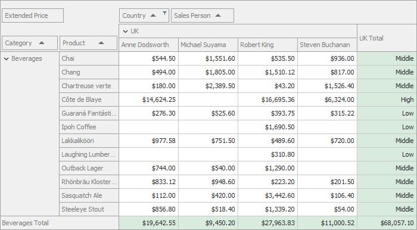

<!-- default badges list -->

<!-- default badges end -->

# Pivot Grid for WinForms - Show Custom Display Text in Row Total Cells

The following example describes how handle the `CustomCellDisplayText` event to show custom display text in the Pivot Grid cells. 

The Pivot Grid shows the following display text instead of the row total cell value:

* "Low" when row total value is less than 2000;
* "Middle" when row total value is between 2000 and 6000;
* "High" when row total value exceeds 6000;

<!-- default file list -->
## Files to Review

* [Form1.cs](./CS/WinFormsPivotCustomCellDisplayText/Form1.cs) (VB: [Form1.vb](./VB/VBWinFormsPivotCustomCellDisplayText/Form1.vb))
<!-- default file list end -->

## Documentation

[CustomCellDisplayText](https://docs.devexpress.com/WindowsForms/DevExpress.XtraPivotGrid.PivotGridControl.CustomCellDisplayText)
